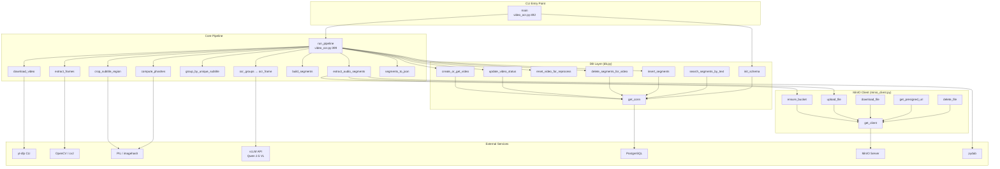

# Phân tích folder: new_pipeline

## 1. Tổng quan

- **Vai trò trong project:** Folder `new_pipeline` là **module chính (core pipeline)** của hệ thống Video-OCR-Pipeline. Thực hiện toàn bộ luồng xử lý: tải video YouTube → trích frame → crop vùng phụ đề → nhận diện dạng ảnh (perceptual hash) để loại trùng → OCR bằng Qwen 2.5 VL qua vLLM → cắt audio theo segment → lưu kết quả JSON + PostgreSQL + MinIO.
- **Số file đã phân tích:** 6 file code/config (bỏ qua `.gitignore`, `README.md`, `output.json`)

| File | Loại | Vai trò ngắn |
|------|------|-------------|
| `video_ocr.py` | Core pipeline | Luồng chính: điều phối toàn bộ 7 bước xử lý video |
| `db.py` | Database layer | CRUD lên PostgreSQL (videos, segments), idempotency |
| `minio_client.py` | Object storage client | Upload/download/presign file audio trên MinIO |
| `schema.sql` | DB schema | Định nghĩa bảng `videos` + `segments` + index FTS |
| `docker-compose.yml` | Infrastructure | Chạy vLLM, PostgreSQL, MinIO bằng Docker |
| `requirements.txt` | Dependencies | Danh sách pip packages |
| `check_db.py` | Utility script | Script nhỏ kiểm tra dữ liệu bảng `videos` |

---

## 2. Phân tích theo file

---

### `video_ocr.py` — Core Pipeline

#### Dataclass: `Frame` — `video_ocr.py:61`
- **Vai trò:** Đại diện cho 1 frame được trích xuất từ video. Là đơn vị dữ liệu trung tâm xuyên suốt pipeline.
- **Thuộc tính:**
  - `timestamp: float` — thời điểm frame trong video (giây)
  - `frame_index: int` — chỉ số frame gốc trong video
  - `path: Path` — đường dẫn file ảnh full-frame
  - `crop_path: Optional[Path]` — đường dẫn ảnh sau crop vùng phụ đề (gán sau bước 3)
  - `text: str` — kết quả OCR (gán sau bước 5)
  - `phash: Optional[str]` — perceptual hash dạng hex (gán sau bước 4)
- **Được sử dụng ở:** Tất cả function trong file — là input/output xuyên suốt pipeline.

#### Dataclass: `Segment` — `video_ocr.py:70`
- **Vai trò:** Đại diện cho 1 đoạn subtitle đã gộp (merged) — chứa thời gian, frame range, text, và file audio tương ứng.
- **Thuộc tính:**
  - `start: float` / `end: float` — thời gian bắt đầu/kết thúc (giây)
  - `start_frame: int` / `end_frame: int` — frame index bắt đầu/kết thúc
  - `text: str` — nội dung phụ đề đã OCR
  - `audio_path: Optional[Path]` — đường dẫn file audio hoặc MinIO object key
- **Được sử dụng ở:** `build_segments()`, `extract_audio_segments()`, `segments_to_json()`, `run_pipeline()`.

---

#### Function: `download_video(url, output_dir) -> Path` — `video_ocr.py:83`
- **Chức năng:** Tải video YouTube dùng `yt-dlp` (format mp4, merge video+audio).
- **Input:** `url` (YouTube URL), `output_dir` (thư mục lưu)
- **Output:** `Path` — đường dẫn file video đã tải
- **Side-effect:** Gọi `subprocess.run` (yt-dlp), tạo file video trên disk
- **Gọi tới:** `subprocess.run` (external: yt-dlp)
- **Được gọi từ:** `run_pipeline()`

#### Function: `extract_frames(video_path, frames_dir, fps) -> tuple[list[Frame], float]` — `video_ocr.py:108`
- **Chức năng:** Mở video bằng OpenCV, lấy frame theo tần suất chỉ định, lưu ra JPEG, tính timestamp từng frame.
- **Input:** `video_path` (Path file video), `frames_dir` (thư mục lưu frame), `fps` (tần suất lấy frame, mặc định 1fps)
- **Output:** `(list[Frame], video_fps)` — danh sách Frame object + fps gốc của video
- **Side-effect:** Gọi `cv2.VideoCapture`, tạo nhiều file JPEG trên disk
- **Gọi tới:** `cv2.VideoCapture`, `Image.fromarray`, `Image.save`
- **Được gọi từ:** `run_pipeline()`

#### Function: `crop_subtitle_region(frames, crop_dir, fraction) -> None` — `video_ocr.py:155`
- **Chức năng:** Crop 28% phía dưới mỗi frame (vùng chứa subtitle), lưu ảnh crop, gán `frame.crop_path`.
- **Input:** `frames` (list[Frame]), `crop_dir`, `fraction` (tỉ lệ crop, mặc định 0.28)
- **Output:** None (mutate `frame.crop_path` in-place)
- **Side-effect:** Tạo file ảnh crop trên disk
- **Gọi tới:** `Image.open`, `Image.crop`, `Image.save`
- **Được gọi từ:** `run_pipeline()`

#### Function: `compute_phashes(frames) -> None` — `video_ocr.py:174`
- **Chức năng:** Tính perceptual hash (pHash) cho ảnh crop của mỗi frame, gán vào `frame.phash`.
- **Input:** `frames` (list[Frame])
- **Output:** None (mutate `frame.phash` in-place)
- **Gọi tới:** `imagehash.phash`
- **Được gọi từ:** `run_pipeline()`

#### Function: `group_by_unique_subtitle(frames, threshold) -> list[list[Frame]]` — `video_ocr.py:180`
- **Chức năng:** Nhóm các frame liên tiếp có hash giống nhau (khoảng cách Hamming ≤ threshold) thành từng group. Mỗi group đại diện cho 1 "câu phụ đề".
- **Input:** `frames` (list[Frame], đã có phash), `threshold` (ngưỡng khác biệt, mặc định 4)
- **Output:** `list[list[Frame]]` — danh sách các group
- **Gọi tới:** `imagehash.hex_to_hash`
- **Được gọi từ:** `run_pipeline()`

#### Function: `image_to_base64(path) -> str` — `video_ocr.py:208`
- **Chức năng:** Đọc file ảnh và encode sang Base64 string.
- **Input:** `path` (Path file ảnh)
- **Output:** Base64 string
- **Gọi tới:** `base64.b64encode`
- **Được gọi từ:** `ocr_frame()`

#### Function: `ocr_frame(image_path, session) -> str` — `video_ocr.py:213`
- **Chức năng:** Gọi API vLLM (OpenAI-compatible `/v1/chat/completions`) với ảnh Base64 + prompt trích xuất subtitle. Trả về text OCR.
- **Input:** `image_path` (Path ảnh crop), `session` (requests.Session)
- **Output:** `str` — nội dung phụ đề trích xuất được
- **Side-effect:** HTTP POST đến vLLM server
- **Gọi tới:** `image_to_base64()`, `requests.Session.post`
- **Được gọi từ:** `ocr_groups()`

#### Function: `ocr_groups(groups) -> None` — `video_ocr.py:254`
- **Chức năng:** OCR lần lượt từng group — chọn frame đại diện ở giữa group để OCR, gán text cho tất cả frame trong group.
- **Input:** `groups` (list[list[Frame]])
- **Output:** None (mutate `frame.text` in-place)
- **Side-effect:** Nhiều HTTP call đến vLLM
- **Gọi tới:** `ocr_frame()`
- **Được gọi từ:** `run_pipeline()`

#### Function: `build_segments(groups, min_duration) -> list[Segment]` — `video_ocr.py:274`
- **Chức năng:** Gộp các group liên tiếp có cùng text thành Segment. Merge avatar: duyệt tuyến tính, nếu text trùng → kéo dài end timestamp, nếu khác → tạo segment mới. Bỏ qua segment có duration < `min_duration` hoặc text rỗng.
- **Input:** `groups` (list[list[Frame]]), `min_duration` (mặc định 0.5s)
- **Output:** `list[Segment]`
- **Gọi tới:** (không gọi function nào)
- **Được gọi từ:** `run_pipeline()`

#### Function: `extract_audio_segments(segments, video_path, audio_dir, video_fps, video_id, use_minio) -> None` — `video_ocr.py:319`
- **Chức năng:** Cắt audio clip cho từng segment từ video gốc (dùng pydub). Nếu `use_minio=True`: upload lên MinIO, xoá file local, lưu MinIO object key vào `seg.audio_path`. Nếu MinIO lỗi → tự fallback giữ file local.
- **Input:** `segments`, `video_path`, `audio_dir`, `video_fps`, `video_id`, `use_minio`
- **Output:** None (mutate `seg.audio_path` in-place)
- **Side-effect:** Đọc audio từ video, tạo file .wav, upload MinIO, xoá file local
- **Gọi tới:** `AudioSegment.from_file`, `AudioSegment.export`, `minio_client.ensure_bucket()`, `minio_client.upload_file()`
- **Được gọi từ:** `run_pipeline()`

#### Function: `segments_to_json(segments, output_path) -> list[dict]` — `video_ocr.py:375`
- **Chức năng:** Serialize danh sách Segment ra file JSON, đồng thời trả về list dict để `db.insert_segments()` dùng tiếp.
- **Input:** `segments` (list[Segment]), `output_path` (Path file JSON)
- **Output:** `list[dict]` — dữ liệu segment dạng dict
- **Side-effect:** Ghi file JSON lên disk
- **Gọi tới:** `json.dump`
- **Được gọi từ:** `run_pipeline()`

#### Function: `run_pipeline(youtube_url, ...) -> list[Segment] | None` — `video_ocr.py:399`
- **Vai trò:** **Hàm trung tâm** — điều phối toàn bộ pipeline 7 bước. Quản lý idempotency qua DB, cập nhật status, xử lý lỗi, cleanup temp dir.
- **Input:** `youtube_url`, và các tham số tuỳ chỉnh (fps, hash_threshold, force, use_minio...)
- **Output:** `list[Segment]` nếu thành công, `None` nếu video đã xử lý trước đó
- **Side-effect:** Tải video, trích frame, crop, OCR, cắt audio, ghi JSON, ghi DB, tạo/xoá thư mục tạm
- **Luồng gọi:**
  1. `db.create_or_get_video()` → kiểm tra idempotency
  2. `download_video()` → status "downloading"
  3. `extract_frames()` → status "extracting"
  4. `crop_subtitle_region()`
  5. `compute_phashes()` + `group_by_unique_subtitle()`
  6. `ocr_groups()` → status "ocr_processing"
  7. `build_segments()`
  8. `extract_audio_segments()` → status "audio_extracting"
  9. `segments_to_json()` + `db.insert_segments()` → status "done"
- **Gọi tới:** `db.create_or_get_video()`, `db.update_video_status()`, `db.reset_video_for_reprocess()`, `db.delete_segments_for_video()`, `db.insert_segments()`, `download_video()`, `extract_frames()`, `crop_subtitle_region()`, `compute_phashes()`, `group_by_unique_subtitle()`, `ocr_groups()`, `build_segments()`, `extract_audio_segments()`, `segments_to_json()`
- **Được gọi từ:** `main()` (CLI entry point)

#### Function: `main()` — `video_ocr.py:492`
- **Vai trò:** CLI entry point — parse argument, set global config, gọi `db.init_schema()`, gọi `run_pipeline()`.
- **Input:** `sys.argv` (command-line arguments)
- **Output:** None
- **Gọi tới:** `argparse.ArgumentParser`, `db.init_schema()`, `run_pipeline()`

---

### `db.py` — Database Layer

#### Function: `get_conn() -> ContextManager[psycopg2.connection]` — `db.py:36`
- **Chức năng:** Context manager tạo connection PostgreSQL. Tự commit nếu thành công, rollback nếu exception, close trong finally.
- **Input:** None (đọc DSN từ env `DATABASE_URL`)
- **Output:** Yield `psycopg2.connection`
- **Side-effect:** Mở/đóng TCP connection đến PostgreSQL
- **Gọi tới:** `psycopg2.connect`
- **Được gọi từ:** Tất cả function khác trong `db.py`

#### Function: `init_schema()` — `db.py:49`
- **Chức năng:** Đọc `schema.sql` và execute toàn bộ, tạo bảng + index nếu chưa có. An toàn gọi lại nhiều lần (IF NOT EXISTS).
- **Input:** None
- **Output:** None
- **Side-effect:** Tạo bảng trong PostgreSQL
- **Gọi tới:** `get_conn()`, đọc file `schema.sql`
- **Được gọi từ:** `main()` trong `video_ocr.py`

#### Function: `get_video_by_url(youtube_url) -> Optional[dict]` — `db.py:66`
- **Chức năng:** Tìm record video theo URL. Trả về RealDictCursor dict hoặc None.
- **Input:** `youtube_url` (str)
- **Output:** `Optional[dict]`
- **Gọi tới:** `get_conn()`
- **Được gọi từ:** `create_or_get_video()`

#### Function: `create_or_get_video(youtube_url, title) -> dict` — `db.py:73`
- **Chức năng:** **Idempotency entry point** — nếu URL đã tồn tại → trả về record cũ; chưa có → INSERT mới với status='pending'. Dùng `ON CONFLICT` để xử lý race condition.
- **Input:** `youtube_url` (str), `title` (str, optional)
- **Output:** `dict` — record video (RealDictCursor)
- **Side-effect:** INSERT row vào bảng `videos` (nếu chưa có)
- **Gọi tới:** `get_video_by_url()`, `get_conn()`
- **Được gọi từ:** `run_pipeline()` trong `video_ocr.py`

#### Function: `update_video_status(video_id, status, error_message, **fields) -> None` — `db.py:96`
- **Chức năng:** UPDATE status của video + các field bổ sung (video_path, video_fps, duration...) qua `**kwargs`. Tự động set `updated_at = now()`.
- **Input:** `video_id` (int), `status` (str), `error_message` (optional), `**fields` (key-value pairs)
- **Output:** None
- **Side-effect:** UPDATE row trong PostgreSQL
- **Gọi tới:** `get_conn()`
- **Được gọi từ:** `run_pipeline()`, `reset_video_for_reprocess()`

#### Function: `reset_video_for_reprocess(video_id) -> None` — `db.py:117`
- **Chức năng:** Đặt lại status='pending' và xoá error_message — dùng khi chạy lại với `--force`.
- **Input:** `video_id` (int)
- **Output:** None
- **Gọi tới:** `update_video_status()`
- **Được gọi từ:** `run_pipeline()` trong `video_ocr.py`

#### Function: `insert_segments(video_id, segments) -> None` — `db.py:126`
- **Chức năng:** Bulk insert segments dùng `psycopg2.extras.execute_values` cho hiệu năng.
- **Input:** `video_id` (int), `segments` (list[dict] — format từ `segments_to_json()`)
- **Output:** None
- **Side-effect:** INSERT nhiều rows vào bảng `segments`
- **Gọi tới:** `get_conn()`, `psycopg2.extras.execute_values`
- **Được gọi từ:** `run_pipeline()` trong `video_ocr.py`

#### Function: `delete_segments_for_video(video_id) -> None` — `db.py:159`
- **Chức năng:** Xoá toàn bộ segments của 1 video — dùng trước khi insert lại khi reprocess.
- **Input:** `video_id` (int)
- **Output:** None
- **Side-effect:** DELETE rows từ bảng `segments`
- **Gọi tới:** `get_conn()`
- **Được gọi từ:** `run_pipeline()` trong `video_ocr.py`

#### Function: `search_segments_by_text(query, limit) -> list[dict]` — `db.py:166`
- **Chức năng:** Full-text search trên nội dung subtitle dùng PostgreSQL `to_tsvector`/`to_tsquery` (config 'simple'). JOIN với `videos` để trả thêm URL + title.
- **Input:** `query` (str), `limit` (int, mặc định 20)
- **Output:** `list[dict]`
- **Gọi tới:** `get_conn()`
- **Được gọi từ:** Chưa được gọi trong code hiện tại — là API sẵn sàng cho tương lai

---

### `minio_client.py` — Object Storage Client

#### Module-level state: `_client: Minio = None` — `minio_client.py:31`
- Singleton client, lazy-init qua `get_client()`.

#### Function: `get_client() -> Minio` — `minio_client.py:34`
- **Chức năng:** Tạo/lấy singleton MinIO client. Lazy initialization lần đầu gọi.
- **Input:** None (đọc từ env: `MINIO_ENDPOINT`, `MINIO_ACCESS_KEY`, `MINIO_SECRET_KEY`, `MINIO_SECURE`)
- **Output:** `Minio` instance
- **Gọi tới:** `Minio()` constructor (external: minio SDK)
- **Được gọi từ:** `ensure_bucket()`, `upload_file()`, `download_file()`, `get_presigned_url()`, `delete_file()`

#### Function: `ensure_bucket(bucket) -> None` — `minio_client.py:46`
- **Chức năng:** Kiểm tra bucket tồn tại, tạo mới nếu chưa có. An toàn gọi nhiều lần (idempotent).
- **Input:** `bucket` (str, mặc định từ env `MINIO_BUCKET`)
- **Output:** None
- **Side-effect:** Tạo bucket mới trên MinIO (nếu chưa có)
- **Gọi tới:** `get_client()`, `client.bucket_exists()`, `client.make_bucket()`
- **Được gọi từ:** `extract_audio_segments()` trong `video_ocr.py`

#### Function: `upload_file(local_path, object_name, bucket) -> str` — `minio_client.py:54`
- **Chức năng:** Upload 1 file local lên MinIO. Trả về `object_name` (key trong bucket).
- **Input:** `local_path` (Path), `object_name` (str), `bucket` (str)
- **Output:** `str` — object_name
- **Side-effect:** Upload file lên MinIO
- **Gọi tới:** `get_client()`, `client.fput_object()`
- **Được gọi từ:** `extract_audio_segments()` trong `video_ocr.py`

#### Function: `download_file(object_name, dest_path, bucket) -> None` — `minio_client.py:62`
- **Chức năng:** Tải 1 file từ MinIO về local.
- **Input:** `object_name` (str), `dest_path` (Path), `bucket` (str)
- **Output:** None
- **Side-effect:** Tạo file local từ MinIO
- **Gọi tới:** `get_client()`, `client.fget_object()`
- **Được gọi từ:** Chưa được gọi trong code hiện tại

#### Function: `get_presigned_url(object_name, expires_seconds, bucket) -> str` — `minio_client.py:68`
- **Chức năng:** Tạo URL tạm (presigned) cho phép truy cập file trực tiếp qua browser.
- **Input:** `object_name` (str), `expires_seconds` (int, mặc định 3600), `bucket` (str)
- **Output:** `str` — presigned URL
- **Gọi tới:** `get_client()`, `client.presigned_get_object()`
- **Được gọi từ:** Chưa được gọi trong code hiện tại

#### Function: `delete_file(object_name, bucket) -> None` — `minio_client.py:77`
- **Chức năng:** Xoá 1 object khỏi MinIO bucket.
- **Input:** `object_name` (str), `bucket` (str)
- **Gọi tới:** `get_client()`, `client.remove_object()`
- **Được gọi từ:** Chưa được gọi trong code hiện tại

---

### `schema.sql` — Database Schema

- **Bảng `videos`:** Lưu metadata video + trạng thái xử lý
  - `id` SERIAL PK, `youtube_url` TEXT UNIQUE, `title` TEXT, `video_path` TEXT
  - `status` TEXT — lifecycle: `pending → downloading → extracting → ocr_processing → audio_extracting → done | failed`
  - `error_message` TEXT, `video_fps` REAL, `duration` REAL
  - `created_at`, `updated_at` TIMESTAMP
  - Index: `idx_videos_status` trên cột `status`

- **Bảng `segments`:** Lưu từng đoạn subtitle đã OCR
  - `id` SERIAL PK, `video_id` INTEGER FK → `videos(id)` ON DELETE CASCADE
  - `start_time` REAL, `end_time` REAL, `duration` REAL
  - `start_frame` INTEGER, `end_frame` INTEGER, `text` TEXT, `audio_file` TEXT
  - `created_at` TIMESTAMP
  - Index: `idx_segments_video_id` trên `video_id`
  - Index GIN: `idx_segments_text_fts` — full-text search trên `text` dùng config `'simple'` (không stem tiếng Việt)

---

### `docker-compose.yml` — Infrastructure

3 service trong network `ocr-net`:

| Service | Image | Port | Vai trò |
|---------|-------|------|---------|
| `vllm` | `vllm/vllm-openai:latest` | 8000 | Serve Qwen2.5-VL-3B-Instruct (GPU, bfloat16, max-model-len 1024) |
| `postgres` | `postgres:16` | 5432 | Database video_ocr, password=postgres |
| `minio` | `minio/minio:latest` | 9000 (API) / 9002 (Console) | Object storage cho audio clips |

- Volume: `postgres_data`, `minio_data`, HuggingFace cache (`~/.cache/huggingface`)
- GPU: vLLM dùng NVIDIA GPU device 0

---

### `check_db.py` — Utility Script

#### Script-level code — `check_db.py:1`
- **Chức năng:** Script nhỏ dùng pandas để đọc bảng `videos` và in ra console. Dùng để debug/kiểm tra nhanh.
- **Lưu ý:** Hard-coded connection params (không dùng env var) — không dùng `get_conn()` từ `db.py`.

---

## 3. Mối quan hệ giữa các thành phần

**Luồng dữ liệu chính:**

1. **YouTube URL → `run_pipeline()`** — entry point
2. **URL → `db.create_or_get_video()`** — kiểm tra/ tạo record `videos`
3. **URL → `download_video()`** (yt-dlp) → file .mp4
4. **.mp4 → `extract_frames()`** (OpenCV) → `list[Frame]`
5. **Frames → `crop_subtitle_region()`** (PIL) → `Frame.crop_path`
6. **Frames → `compute_phashes()` + `group_by_unique_subtitle()`** (imagehash) → `list[list[Frame]]`
7. **Groups → `ocr_groups()` → `ocr_frame()`** (vLLM HTTP) → `Frame.text`
8. **Groups → `build_segments()`** → `list[Segment]`
9. **Segments + .mp4 → `extract_audio_segments()`** (pydub + MinIO) → `Segment.audio_path`
10. **Segments → `segments_to_json()`** → `output.json` + `list[dict]`
11. **dicts → `db.insert_segments()`** → bảng `segments` trong PostgreSQL
12. **`db.update_video_status("done")`** → hoàn tất

---

## 4. Nhận xét / Đề xuất

### Điểm cần lưu ý

1. **Duplicate subtitle segments trong `output.json`:** Nhiều segment liên tiếp có text gần như giống hệt (OCR nhẹ khác biệt 1-2 ký tự), cho thấy bước dedup bằng perceptual hash chỉ phát hiện frame giống ở mức ảnh, nhưng text do OCR có thể khác nhỏ → `build_segments()` không merge được vì so sánh exact string. VD: segment 9-11, 72-76.
   - **Đề xuất:** Thêm fuzzy match (e.g. Levenshtein distance ≤ 2) trong `build_segments()` thay vì `text == mt`.

2. **SQL Injection trong `update_video_status()`:** `db.py:107` dùng f-string `f"{key} = %s"` cho `**fields` keys. Nếu key đến từ input không đáng tin cậy, có thể inject tên cột. Hiện tại chỉ gọi từ `run_pipeline()` với key cố định nên rủi ro thấp, nhưng nên whitelist các column name hợp lệ.

3. **OCR lỗi không retry:** `ocr_groups()` bắt exception nhưng chỉ log warning và gán `text = ""` → cả group mất text, có thể bỏ sót nội dung quan trọng.
   - **Đề xuất:** Thêm retry (1-2 lần) hoặc chọn frame khác trong group.

4. **`check_db.py` không dùng chung config:** Hard-code connection params thay vì dùng `DATABASE_URL` env var như `db.py`.
   - **Đề xuất:** Dùng `db.get_conn()` hoặc ít nhất đọc `DATABASE_URL` từ env.

5. **MinIO console port mismatch:** `docker-compose.yml:55` set `--console-address ":9001"` nhưng port mapping là `9002:9002`. Console sẽ không truy cập được ở port 9002.
   - **Đề xuất:** Đồng bộ: `--console-address ":9002"` hoặc đổi mapping sang `9001:9001`.

6. **`_client` singleton không thread-safe:** `minio_client.py:34` dùng global `_client` với kiểm tra `if _client is None` — không an toàn nếu chạy đa luồng.
   - **Đề xuất:** Dùng `threading.Lock` hoặc khởi tạo client ở module level.

7. **Không có connection pooling:** `db.py` tạo connection mới cho mỗi operation (mở → dùng → close). Nếu pipeline chạy với nhiều video song song, sẽ tốn tài nguyên.
   - **Đề xuất:** Dùng `psycopg2.pool` hoặc `contextlib` pattern giữ connection sống trong suốt 1 lần `run_pipeline()`.

8. **`search_segments_by_text()` chưa được sử dụng:** Đã implement FTS search nhưng chưa có API endpoint hay CLI nào gọi. Là tính năng "sẵn sàng cho tương lai".

### Điểm tốt

- Idempotent design: `create_or_get_video()` + `ON CONFLICT` tránh xử lý lại video đã xong.
- Graceful fallback: MinIO down → tự fallback lưu local, pipeline không crash.
- Status lifecycle rõ ràng (pending → downloading → ... → done/failed), dễ debug.
- CLI đầy đủ options, dễ tùy chỉnh (`--fps`, `--hash-threshold`, `--force`...).
- Separation of concerns tốt: DB layer, MinIO client, pipeline logic tách riêng.
