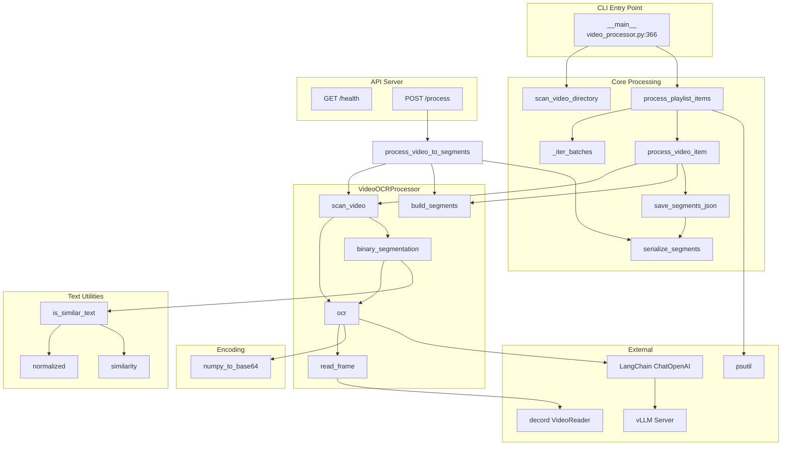

# Phân tích folder: old_pipeline

## 1. Tổng quan

- **Vai trò trong project:** Folder `old_pipeline` là **phiên bản cũ** của hệ thống Video-OCR-Pipeline. Sử dụng thuật toán **binary segmentation** (chia nhị phân đệ quy) để tìm điểm chuyển subtitle, kết hợp OCR bằng Qwen 2.5 VL qua LangChain + vLLM. Cung cấp cả CLI xử lý batch và REST API (FastAPI).
- **Số file đã phân tích:** 4 file (2 file .py, 2 file config)

| File | Loại | Vai trò ngắn |
|------|------|-------------|
| `video_processor.py` | Core processing | Xử lý video OCR: scan + binary segmentation, batch processing, CLI |
| `api_server.py` | REST API | FastAPI server nhận upload video → trả về segments OCR |
| `Dockerfile` | Container | Build Docker image để chạy pipeline/API |
| `requirements.txt` | Dependencies | Danh sách pip packages |

---

## 2. Phân tích theo file

---

### `video_processor.py` — Core Video Processing

#### Dataclass: `PlaylistItem` — `video_processor.py:36`
- **Vai trò:** Đại diện cho 1 video trong danh sách cần xử lý (playlist). Dùng khi xử lý batch nhiều video.
- **Thuộc tính:**
  - `index: int` — thứ tự video trong playlist
  - `title: str` — tên video (lấy từ filename stem)
  - `video_path: str` — đường dẫn file video trên disk
- **Được sử dụng ở:** `process_video_item()`, `process_playlist_items()`, `scan_video_directory()`

---

#### Class: `VideoOCRProcessor` — `video_processor.py:87`

- **Vai trò / trách nhiệm:** Là class trung tâm xử lý OCR cho 1 video. Sử dụng thuật toán **binary segmentation** đệ quy: scan video theo bước nhảy cố định, khi phát hiện text thay đổi → chia nhị phân để tìm chính xác thời điểm chuyển subtitle. Hỗ trợ context manager để tự giải phóng bộ nhớ.

- **Kế thừa / implement:** Không kế thừa. Implements context manager protocol (`__enter__`/`__exit__`).

- **Thuộc tính chính:**
  - `video_path: str` — đường dẫn video
  - `crop: tuple` — vùng crop (x1, y1, x2, y2), mặc định `(100, 530, 1200, 680)`
  - `vr: VideoReader` — decord VideoReader để đọc frame random-access
  - `total_frames: int` — tổng số frame
  - `video_fps: float` — fps video
  - `ocr_calls: int` — đếm số lần gọi OCR (metric)
  - `ocr_cache: dict` — cache kết quả OCR theo `frame_time` → tránh gọi lại

- **Method quan trọng:**

  - `__init__(video_path, crop)` — `video_processor.py:88`: Khởi tạo VideoReader (decord), tính total_frames, video_fps. Khởi tạo cache rỗng.
  
  - `cleanup()` — `video_processor.py:97`: Xoá ocr_cache, giải phóng VideoReader. Được gọi tự động khi thoát context manager.
  
  - `__enter__()` / `__exit__()` — `video_processor.py:102-107`: Hỗ trợ `with VideoOCRProcessor(path) as proc:`.
  
  - `read_frame(time_point) -> np.ndarray | None` — `video_processor.py:109`: Đọc frame tại thời điểm (giây) từ video, crop région, trả về numpy array. Dùng decord random access `vr[frame_index]`.
    - **Input:** `time_point` (float — thời điểm giây)
    - **Output:** numpy array (frame đã crop) hoặc `None` nếu index ngoài range
  
  - `ocr(frame_time) -> str` — `video_processor.py:120`: OCR 1 frame tại thời điểm cho trước. Kiểm tra cache trước, nếu chưa có → `read_frame()` → encode Base64 → gọi LLM (LangChain HumanMessage) → cache kết quả.
    - **Input:** `frame_time` (float)
    - **Output:** `str` — text OCR
    - **Side-effect:** HTTP call đến vLLM, cache kết quả
    - **Gọi tới:** `read_frame()`, `numpy_to_base64()`, `llm.invoke()`
  
  - `binary_segmentation(left_time, right_time, left_text, right_text, threshold, sim_threshold) -> list[dict]` — `video_processor.py:149`: **Thuật toán chia nhị phân đệ quy**. So sánh text ở 2 điểm, nếu giống nhau → không có chuyển; nếu khác → chia đôi và đệ quy cho đến khi khoảng cách ≤ `threshold` (0.5s). Trả về list segment `{"end": int, "text": str}`.
    - **Input:** `left_time`, `right_time`, `left_text`, `right_text`, `threshold` (0.5s), `sim_threshold` (0.9)
    - **Output:** `list[dict]` — danh sách điểm chuyển subtitle
    - **Gọi tới:** `ocr()`, `is_similar_text()` (đệ quy chính nó)
  
  - `scan_video(scan_step) -> list[dict]` — `video_processor.py:170`: Scan toàn bộ video. OCR tại mỗi `scan_step` giây (mặc định 4s). Khi phát hiện text khác với frame trước → gọi `binary_segmentation()` để tìm chính xác điểm chuyển.
    - **Input:** `scan_step` (int — bước nhảy scan, mặc định 4)
    - **Output:** `list[dict]` — tất cả điểm chuyển subtitle trong video
    - **Gọi tới:** `ocr()`, `binary_segmentation()`
  
  - `build_segments(timestamps) -> list[dict]` — `video_processor.py:191` *(static method)*: Chuyển danh sách điểm chuyển thành segment có cả `start` và `end`. `start` của segment này = `end` của segment trước.
    - **Input:** `timestamps` (list[dict] — output từ `scan_video()`)
    - **Output:** `list[dict]` — segments `{"start", "end", "text"}`

- **Phụ thuộc vào:** `decord.VideoReader`, `langchain_openai.ChatOpenAI`, `cv2`, `numpy`

- **Được sử dụng ở:** `process_video_item()`, `process_video_to_segments()`

---

#### Function: `normalized(text) -> str` — `video_processor.py:41`
- **Chức năng:** Chuẩn hoá text để so sánh: strip, bỏ newline, lowercase, nối dấu gạch ngang, bỏ dấu tiếng Việt (NFD decomposition + lọc category Mn).
- **Input:** `text` (str hoặc None)
- **Output:** `str` — text đã chuẩn hoá (không dấu, lowercase)
- **Gọi tới:** `unicodedata.normalize()`, `unicodedata.category()`
- **Được gọi từ:** `is_similar_text()`

#### Function: `similarity(a, b) -> float` — `video_processor.py:57`
- **Chức năng:** Tính tỉ lệ giống nhau giữa 2 chuỗi dùng `difflib.SequenceMatcher`.
- **Input:** `a`, `b` (str)
- **Output:** `float` (0.0 → 1.0)
- **Gọi tới:** `SequenceMatcher.ratio()`
- **Được gọi từ:** `is_similar_text()`

#### Function: `is_similar_text(a, b, sim_threshold=0.85) -> bool` — `video_processor.py:60`
- **Chức năng:** So sánh 2 chuỗi text sau khi chuẩn hoá, trả về True nếu similarity ≥ `sim_threshold`.
- **Input:** `a`, `b` (str), `sim_threshold` (float, mặc định 0.85)
- **Output:** `bool`
- **Gọi tới:** `normalized()`, `similarity()`
- **Được gọi từ:** `binary_segmentation()`

#### Function: `numpy_to_base64(img) -> str` — `video_processor.py:68`
- **Chức năng:** Encode numpy array → PNG → Base64 string. Dùng để gửi ảnh trong LLM message.
- **Input:** `img` (np.ndarray)
- **Output:** `str` (Base64)
- **Gọi tới:** `cv2.imencode()`, `base64.b64encode()`
- **Được gọi từ:** `VideoOCRProcessor.ocr()`

#### Function: `get_llm(temperature=0.0) -> ChatOpenAI` — `video_processor.py:75`
- **Chức năng:** Khởi tạo LangChain ChatOpenAI client kết nối đến vLLM server. Tắt SSL verify (httpx Client).
- **Input:** `temperature` (float, mặc định 0.0)
- **Output:** `ChatOpenAI` instance
- **Gọi tới:** `ChatOpenAI()`, `httpx.Client(verify=False)`
- **Được gọi từ:** Module-level: `llm = get_llm()` (singleton global)

#### Function: `serialize_segments(segments) -> list[dict]` — `video_processor.py:211`
- **Chức năng:** Chuyển segments → list dict JSON-ready, thêm `id` cho mỗi segment.
- **Input:** `segments` (list[dict] với key `start`, `end`, `text`)
- **Output:** `list[dict]` — mỗi dict có `id`, `start`, `end`, `text`
- **Được gọi từ:** `save_segments_json()`, `process_video_to_segments()`

#### Function: `save_segments_json(segments, json_output) -> list[dict]` — `video_processor.py:230`
- **Chức năng:** Serialize segments, ghi file JSON, trả về data dict.
- **Input:** `segments`, `json_output` (đường dẫn file output)
- **Output:** `list[dict]`
- **Side-effect:** Ghi file JSON
- **Gọi tới:** `serialize_segments()`, `json.dump()`
- **Được gọi từ:** `process_video_item()`

#### Function: `process_video_item(item, base_output_dir, scan_step) -> dict` — `video_processor.py:240`
- **Chức năng:** Xử lý 1 PlaylistItem: tạo VideoOCRProcessor → scan → build segments → lưu JSON → trả thống kê (index, title, segment_count, ocr_calls).
- **Input:** `item` (PlaylistItem), `base_output_dir` (str), `scan_step` (int)
- **Output:** `dict` — kết quả xử lý
- **Side-effect:** Ghi file JSON, sử dụng context manager cleanup
- **Gọi tới:** `VideoOCRProcessor`, `scan_video()`, `build_segments()`, `save_segments_json()`
- **Được gọi từ:** `process_playlist_items()` (qua ThreadPoolExecutor)

#### Function: `process_video_to_segments(video_path, scan_step, crop) -> list[dict]` — `video_processor.py:266`
- **Chức năng:** API-friendly: xử lý 1 video đường dẫn file, trả về segments (không lưu file). Dùng bởi `api_server.py`.
- **Input:** `video_path` (str), `scan_step` (int), `crop` (tuple hoặc None)
- **Output:** `list[dict]` — serialized segments
- **Gọi tới:** `VideoOCRProcessor`, `scan_video()`, `build_segments()`, `serialize_segments()`
- **Được gọi từ:** `api_server.py` endpoint `/process`

#### Function: `_iter_batches(items, batch_size) -> Generator` — `video_processor.py:278`
- **Chức năng:** Helper chia list thành các batch con.
- **Input:** `items` (list), `batch_size` (int)
- **Output:** Generator yield từng batch
- **Được gọi từ:** `process_playlist_items()`

#### Function: `process_playlist_items(items, base_output_dir, batch_size, scan_step, start_index, end_index) -> list[dict]` — `video_processor.py:283`
- **Chức năng:** Xử lý batch nhiều video. Lọc theo index range, chia batch, chạy song song bằng ThreadPoolExecutor (mỗi batch có `batch_size` worker). Force GC sau mỗi batch. In thống kê từng batch + memory usage.
- **Input:** `items` (list[PlaylistItem]), `base_output_dir`, `batch_size` (4), `scan_step` (4), `start_index`, `end_index`
- **Output:** `list[dict]` — kết quả sorted theo index
- **Side-effect:** Tạo thư mục, ghi file JSON, đa luồng, GC
- **Gọi tới:** `_iter_batches()`, `process_video_item()`, `gc.collect()`, `log_mem()`
- **Được gọi từ:** `__main__` block

#### Function: `scan_video_directory(video_dir) -> list[PlaylistItem]` — `video_processor.py:338`
- **Chức năng:** Scan thư mục, tìm file .mp4, tạo PlaylistItem cho từng video.
- **Input:** `video_dir` (str)
- **Output:** `list[PlaylistItem]` — sorted theo filename
- **Được gọi từ:** `__main__` block

#### Module-level: `_rss_mb() -> float` — `video_processor.py:21`
- **Chức năng:** Tính tổng RSS memory (MB) của process + tất cả child processes. Dùng để monitor memory khi xử lý batch.

#### Module-level: `log_mem(tag)` — `video_processor.py:31`
- **Chức năng:** In log memory usage với tag.

#### Module-level global: `llm = get_llm()` — `video_processor.py:85`
- **Chức năng:** Singleton LLM client khởi tạo lúc import module. Tất cả `VideoOCRProcessor` instance dùng chung 1 LLM client.

---

### `api_server.py` — REST API Server

#### Endpoint: `GET /health` — `api_server.py:15`
- **Chức năng:** Health check endpoint, trả về `{"status": "ok"}`.
- **Output:** `dict`

#### Endpoint: `POST /process` — `api_server.py:20`
- **Chức năng:** Nhận upload file video + tham số (scan_step, crop) → xử lý OCR → trả về segments JSON.
- **Input (form-data):**
  - `file: UploadFile` — file video (bắt buộc)
  - `scan_step: int` — bước nhảy scan (mặc định 4)
  - `crop: Optional[str]` — crop region dạng "x1,y1,x2,y2" (optional)
- **Output:** `dict` — `{"filename", "segment_count", "segments"}`
- **Side-effect:** Lưu file tạm, xử lý OCR, xoá file tạm
- **Gọi tới:** `process_video_to_segments()`
- **Luồng:**
  1. Validate `scan_step >= 1`
  2. Parse `crop` string → tuple (nếu có)
  3. Lưu uploaded file vào tempfile
  4. Gọi `process_video_to_segments()`
  5. Trả kết quả + XOÁ file tạm trong `finally`

---

### `Dockerfile` — Container Build

- **Base image:** `python:3.11-slim`
- **Cài đặt:** ffmpeg, libsm6, libxext6, libgl1 (dependencies cho OpenCV + decord)
- **Copy:** `requirements.txt` → pip install → copy `video_processor.py`, `api_server.py`
- **Lưu ý:** Lệnh `COPY video_processor.py .` bị lặp (dòng 17 + 19)
- **CMD:** `python video_processor.py` (chạy CLI batch, không chạy API server)

---

### `requirements.txt` — Dependencies

| Package | Version | Vai trò |
|---------|---------|---------|
| `numpy` | ≥1.24.0 | Xử lý mảng frame |
| `opencv-python-headless` | ≥4.8.0 | Encode ảnh (imencode) |
| `decord` | ≥0.6.0 | Đọc video random-access |
| `langchain-openai` | ≥0.1.0 | ChatOpenAI client cho vLLM |
| `langchain-core` | ≥0.3.0 | LangChain core (HumanMessage) |
| `httpx` | ≥0.25.0 | HTTP client cho LangChain |
| `psutil` | ≥5.9.0 | Monitor memory (RSS) |
| `fastapi` | ≥0.110.0 | REST API framework |
| `uvicorn` | ≥0.23.0 | ASGI server |
| `python-multipart` | ≥0.0.6 | Parse multipart form upload |

---

## 3. Mối quan hệ giữa các thành phần

**Luồng xử lý CLI:**
1. `scan_video_directory()` → tạo `list[PlaylistItem]`
2. `process_playlist_items()` → chia batch → `ThreadPoolExecutor`
3. Mỗi thread → `process_video_item()` → `VideoOCRProcessor`
4. `scan_video()` → scan mỗi `scan_step` giây, OCR từng điểm
5. Khi text thay đổi → `binary_segmentation()` → đệ quy chia đôi đến khi ≤ 0.5s
6. `build_segments()` → tính start/end
7. `save_segments_json()` → ghi JSON

**Luồng xử lý API:**
1. `POST /process` → lưu file tạm → `process_video_to_segments()`
2. Tạo `VideoOCRProcessor` → `scan_video()` → `build_segments()` → `serialize_segments()`
3. Trả JSON + xoá file tạm

---

## 4. Nhận xét / Đề xuất

### Điểm cần lưu ý

1. **Binary segmentation ⇒ nhiều OCR calls:** Thuật toán chia nhị phân đệ quy gọi OCR tại mỗi điểm chia. Nếu subtitle ngắn (1-2s) hoặc video có nhiều đoạn chuyển, số OCR call tăng theo cấp số nhân. So với `new_pipeline` dùng perceptual hash (1 OCR/group), old_pipeline tốn nhiều API call hơn đáng kể.

2. **Singleton `llm` global không thread-safe:** `llm = get_llm()` khởi tạo ở module level, dùng chung cho tất cả `VideoOCRProcessor` instance. `ChatOpenAI.invoke()` có thể không an toàn khi gọi đồng thời từ ThreadPoolExecutor.
   - **Đề xuất:** Tạo LLM client riêng cho mỗi thread/processor, hoặc dùng lock.

3. **SSL verify=False:** `httpx.Client(verify=False)` tắt hoàn toàn SSL verification — an toàn nếu chỉ gọi vLLM local, nhưng nguy hiểm nếu mở rộng kết nối server bên ngoài.
   - **Đề xuất:** Chỉ tắt cho local, dùng env var để bật/tắt.

4. **Hardcoded crop region:** `crop=(100, 530, 1200, 680)` là pixel tuyệt đối → chỉ đúng với video có đúng resolución đó. Video khác kích thước sẽ crop sai.
   - **Đề xuất:** Dùng tỉ lệ phần trăm (như `new_pipeline` đã làm) hoặc tự detect vùng subtitle.

5. **Dockerfile COPY lặp:** `COPY video_processor.py` xuất hiện 2 lần (dòng 17 + 19).
   - **Đề xuất:** Xoá dòng 19 (lặp).

6. **Dockerfile CMD chỉ chạy CLI:** `CMD ["python", "video_processor.py"]` chạy batch CLI, không chạy API server. Muốn chạy API phải ghi đè command.
   - **Đề xuất:** Thêm CMD thay thế cho API (`uvicorn api_server:app`), hoặc dùng entrypoint script.

7. **`VideoOCRProcessor.ocr()` không có error handling:** Nếu LLM call fail (timeout, server down) → exception lan ra ngoài, crash cả process. `new_pipeline` đã wrap try/except + fallback text rỗng.

8. **`normalized()` bỏ dấu tiếng Việt:** Việc strip dấu giúp so sánh fuzzy nhưng mất thông tin — ví dụ "nâng" vs "náng" sẽ được coi giống nhau. Phù hợp cho detection điểm chuyển nhưng có thể gây false positive.

9. **Hardcoded path trong `__main__`:** `/home/app/cuonglp1/speech_topic/data/raw` — chứa username và path tuyệt đối, không portable.

10. **Không có persistence (DB):** Kết quả chỉ lưu file JSON, không có database. So với `new_pipeline` có PostgreSQL + MinIO. Không có idempotency — chạy lại sẽ xử lý lại toàn bộ.

### So sánh với new_pipeline

| Khía cạnh | old_pipeline | new_pipeline |
|-----------|-------------|-------------|
| Phát hiện điểm chuyển subtitle | Binary segmentation đệ quy + OCR | Perceptual hash + 1 OCR/group |
| Số OCR calls | Nhiều (mỗi điểm chia + mỗi scan point) | Ít (1 frame đại diện / group) |
| Phép so sánh text | Fuzzy (SequenceRatio ≥ 0.85-0.9) | Exact string match |
| Đọc video | decord (random access) | OpenCV (sequential read) |
| LLM client | LangChain ChatOpenAI | requests trực tiếp (OpenAI API) |
| API Server | FastAPI (upload file) | Không có (CLI only) |
| Batch processing | ThreadPoolExecutor + GC | Không có (1 video/lần) |
| Audio extraction | Không có | pydub + MinIO |
| Persistence | File JSON only | PostgreSQL + MinIO |
| Idempotency | Không có | Có (DB status + ON CONFLICT) |
| Memory monitoring | psutil RSS log | Không có |
